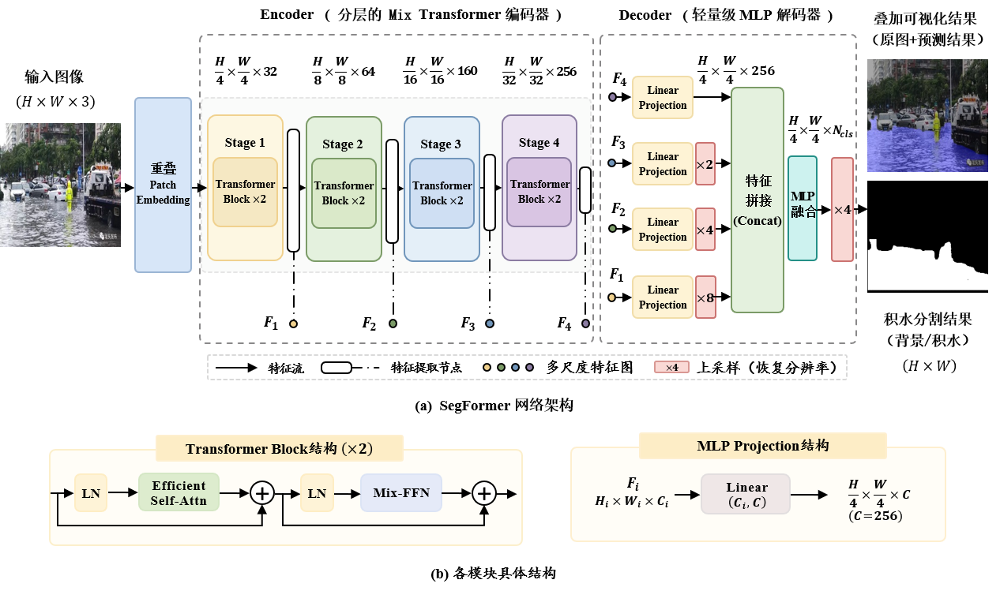

## Abstract

To address the problems of low efficiency of manual inspection and the difficulty of accurately obtaining waterlogging extents using traditional object detection methods in urban road waterlogging monitoring, a SegFormer-based intelligent identification method for urban road waterlogging is proposed. The SegFormer semantic segmentation network is employed to achieve pixel-level identification of waterlogged areas in complex road environments through multi-scale feature extraction and global context modeling. Experiments are conducted based on the training set of the public UW-Bench dataset and a self-constructed urban road waterlogging image test set, with comparisons against U-Net, Mask R-CNN, YOLOv8-seg, PSPNet, and DeepLabV3. The results demonstrate that SegFormer achieves superior performance in urban road waterlogging identification, with a precision of 94.50%, recall of 93.62%, F1-score of 94.06%, and mIoU of 93.08%. The model contains 3.71 M parameters and achieves an inference speed of 63.07 frames/s for a single 512×512 pixel image. The proposed method can effectively extract the spatial distribution characteristics of urban road waterlogging and provide technical support for urban flood monitoring, risk assessment, and smart water management while maintaining high identification accuracy and real-time performance.

  

## UW-Bench Dataset
* Please note that</b> the training set ([Google Drive](https://docs.google.com/forms/d/e/1FAIpQLSfEP8b8D2MUJ23YbCmtrdc7-1-_8YH7bspRdwHYklpGR9L5zw/viewform?usp=dialog))

